# Немного фото проекта.

&#x20; 

## Пробная версия

&#x20; 

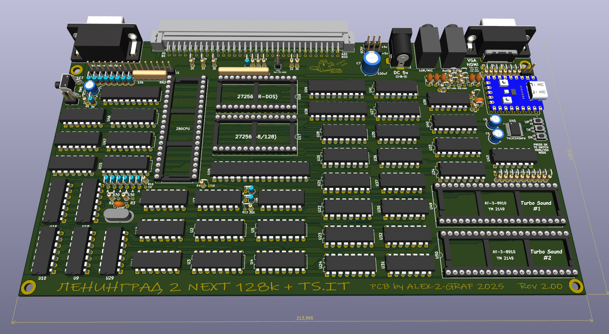  

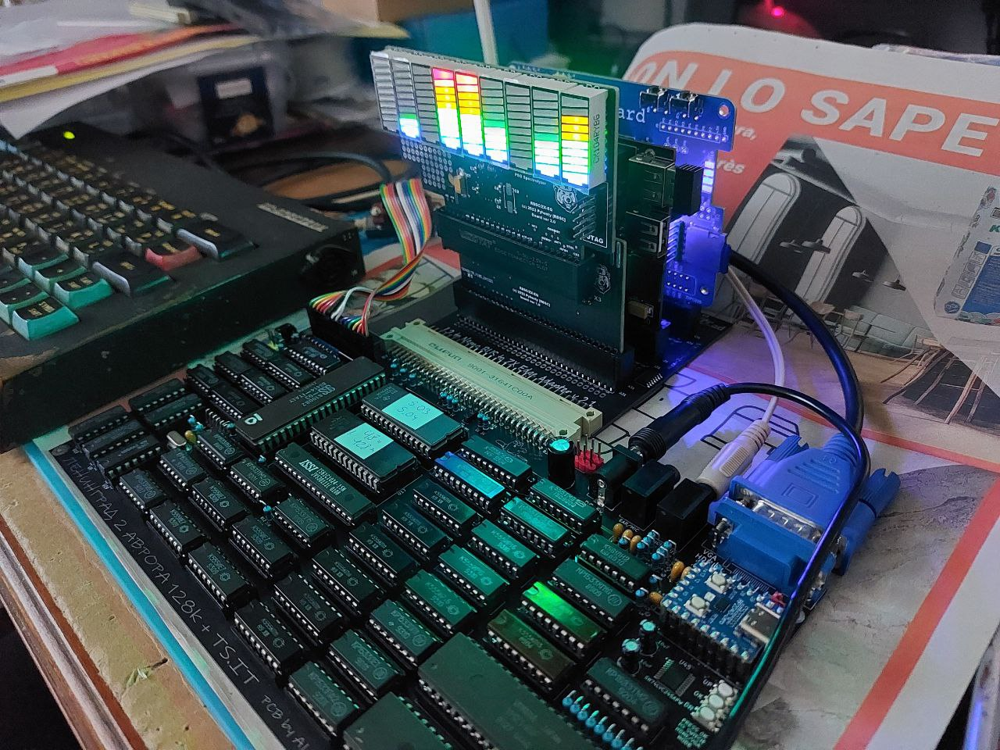  

&#x20; 

## Первая ревизия

&#x20; 

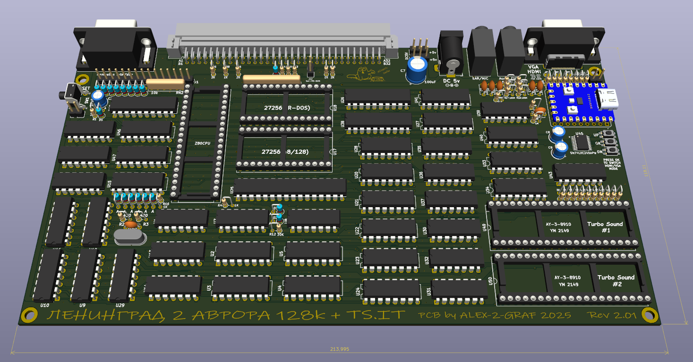  

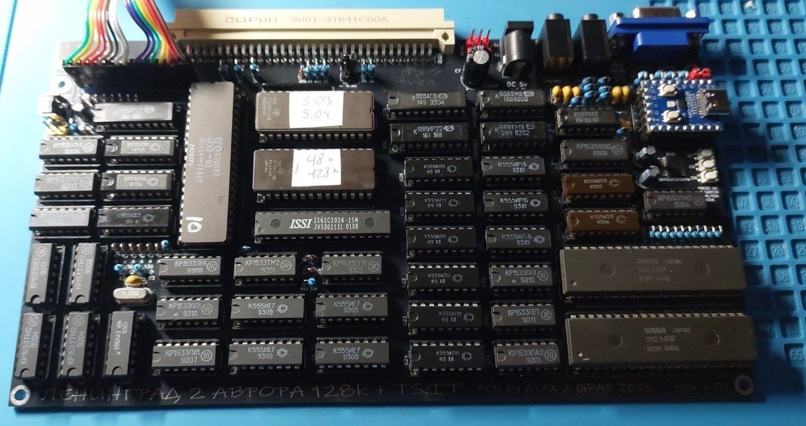  

&#x20; 

## Вторая ревизия

&#x20; 

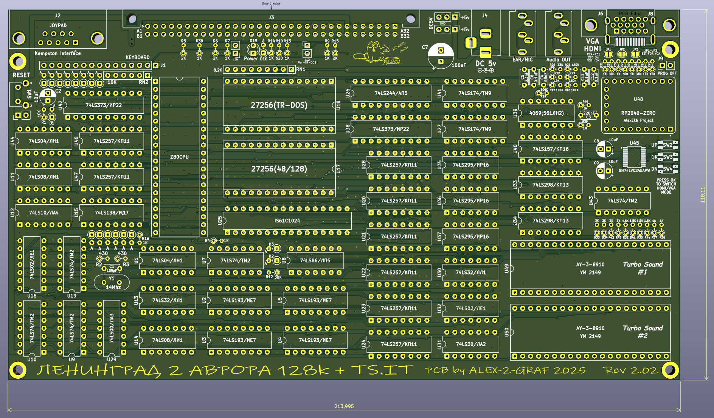  

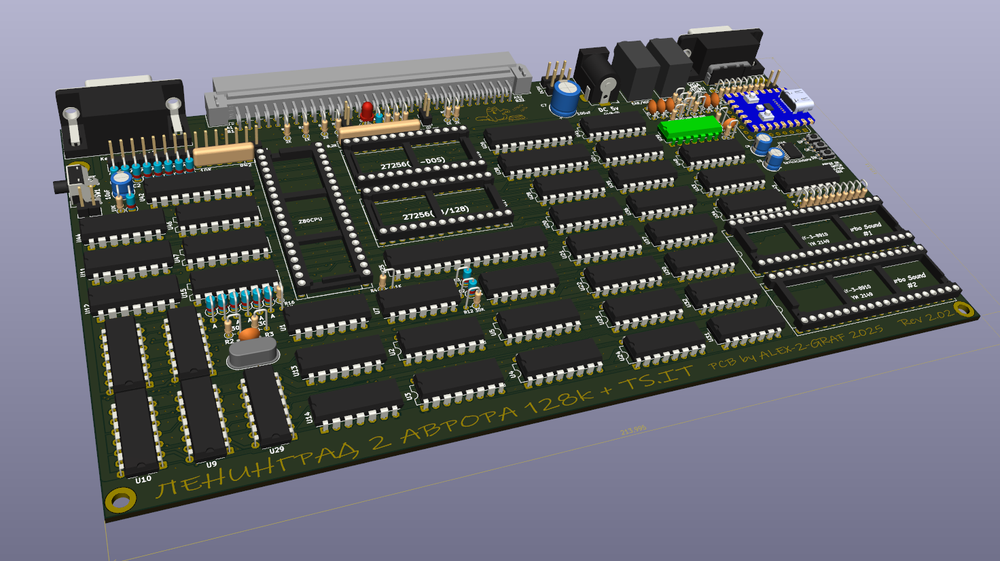  

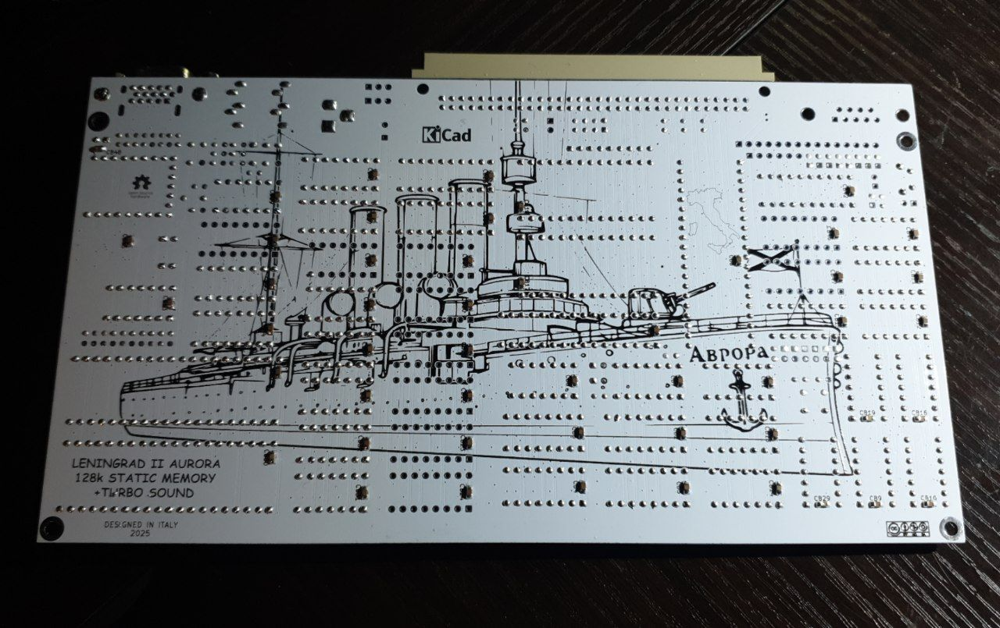  

&#x20; 

## Переходник

&#x20; 

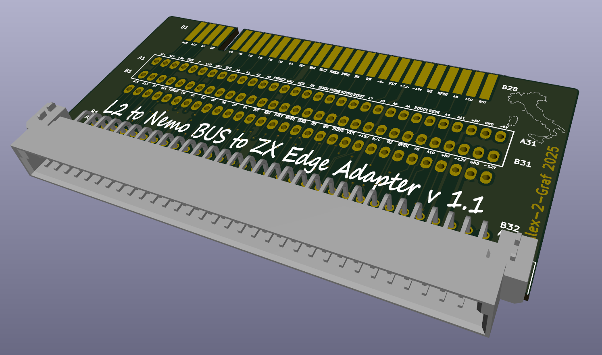  

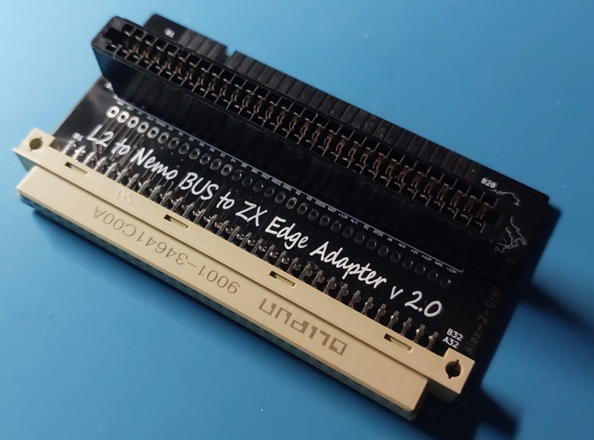  

&#x20; 

## Расширитель шины

&#x20; 

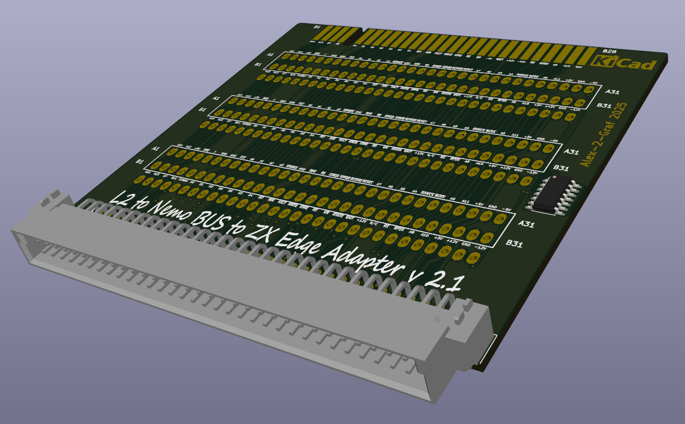  

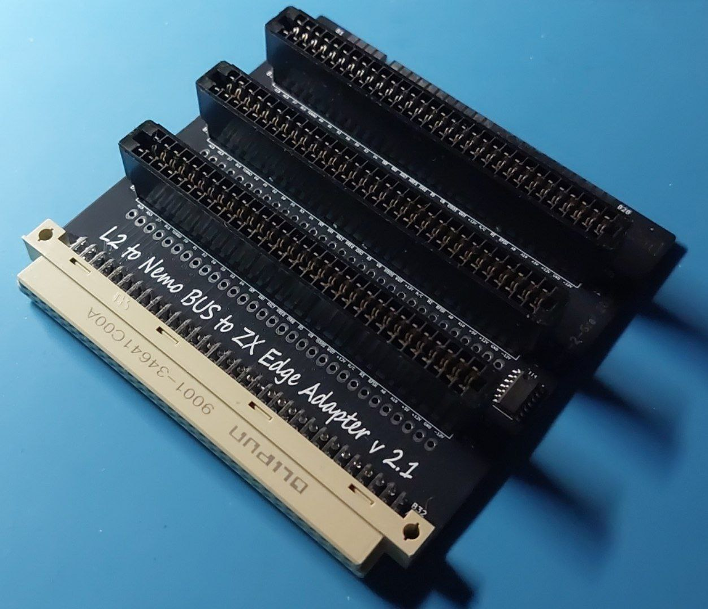  

&#x20; 

## Второй расширитель шины

&#x20; 

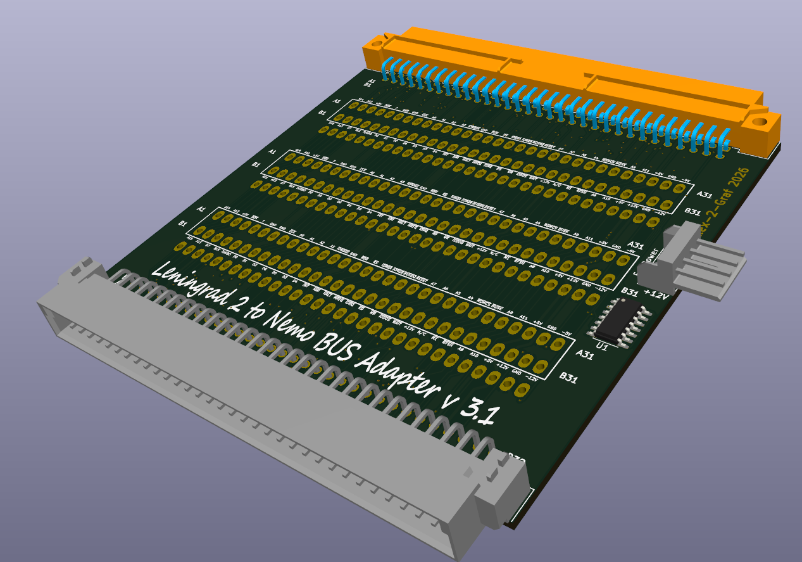  

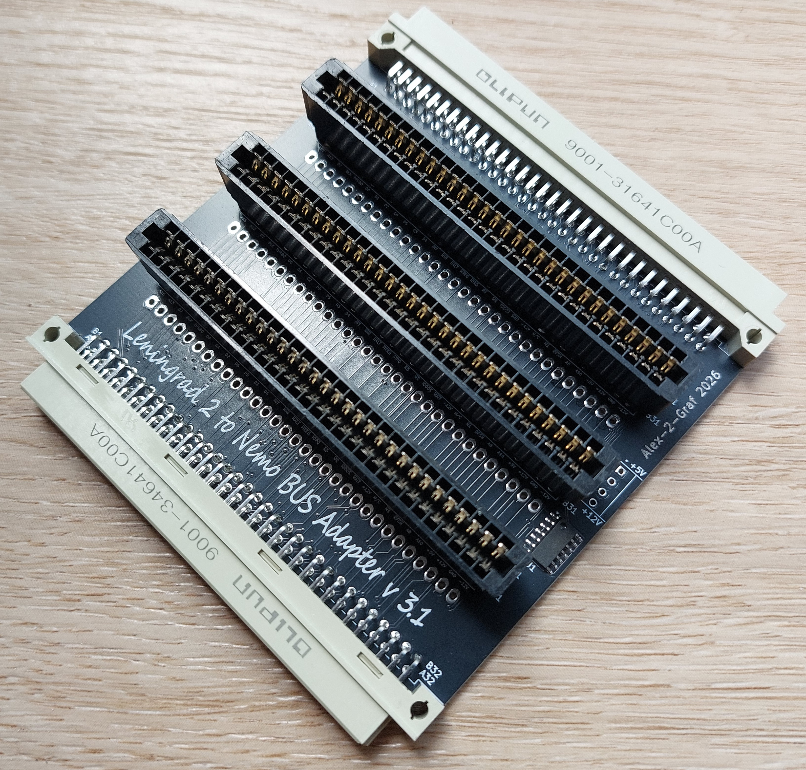  

&#x20; 

## Переходник ZX-bus

&#x20; 

  

&#x20; 

## Клавиатура

&#x20; 

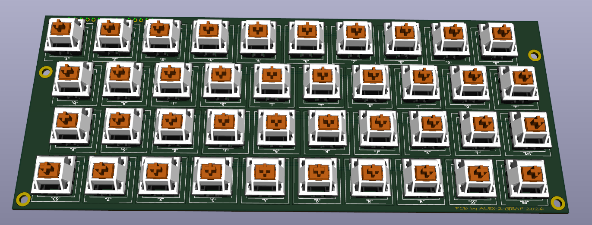  

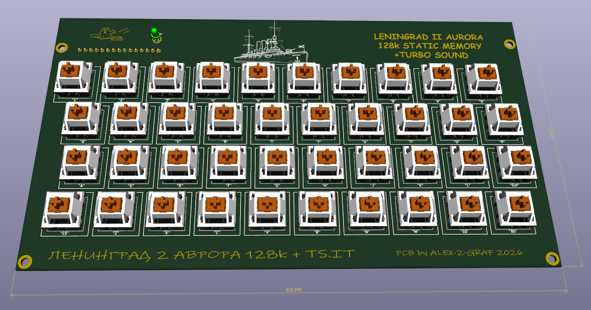  

