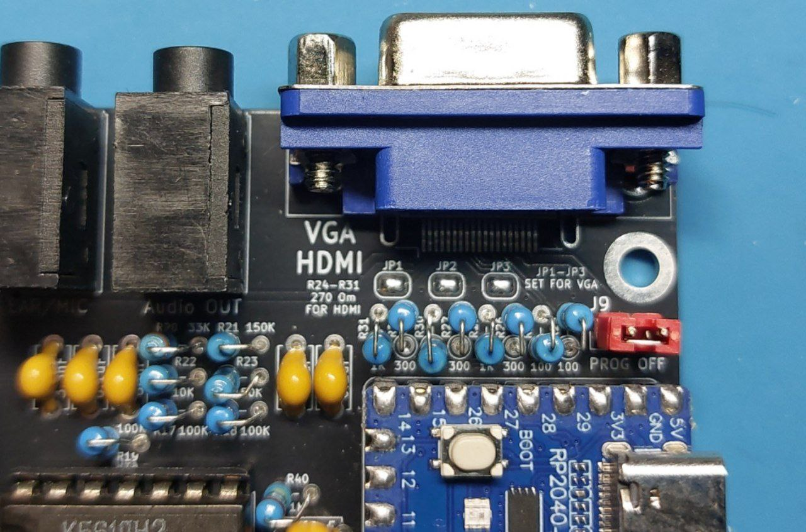
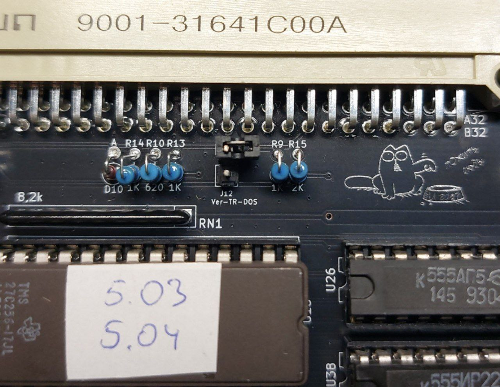

# Leningrad-2-128k-SRAM

## Leningrad-2. Russian ZX Spectrum clone. Schematics and PCB.

После успешного запуска [Leningrad-2-48k](https://github.com/Alex-2-Graf/LENINGRAD-2-48k) и с учётом предложений сообщества  
было принято решение использовать в проекте статическую память вместо динамической.  
Пришлось существенно переделать узел обращения к памяти.  
Заодно было реализовано расширение до 128K без использования внешних плат.  
Также на освободившемся месте удалось разместить два чипа YM2149F,  
тем самым получив «из коробки» Turbo Sound от NedoPC.  
Также был добавлен арбитр IORQ.  
В результате на свет появился «Ленинград 2 NEXT 128K + TS 2025».  

  
  
После сборки и отладки были устранены мелкие недостатки.  
Также по настойчивым просьбам друзей проект получил новое название.  
Свет увидела новая версия [2.01](Export/Leningrad%202%20128k%20SRAM%202.01%202025.html) [Схема](Export/Leningrad%202%20128k%20SRAM%202.01%202025.pdf) [Gerber](Gerber/Leningrad%202%20128k%20SRAM%202.01%202025%20gerber%20made%20in%20Italy.zip)  

  
  
Не обошлось и без курьёза.  
По настойчивой просьбе производителя плат  
пришлось изменить надпись с "Made in" на "Designed in" ;)  
  
После сборки всё заработало без нареканий.  

  
  
Перед выпуском следующей версии были добавлены индикатор питания и исправлен порт джойстика.  
В производство отправилась версия [2.02](Export/Leningrad%202%20128k%20SRAM%202.02%202025.html) [Схема](Export/Leningrad%202%20128k%20SRAM%202.02%202025.pdf) [Gerber](Gerber/Leningrad%202%20128k%20SRAM%202.02%202025%20Gerber.zip)  
  
  
  
Также был выпущен переходник на Немо и ZX-bus [Gerber](Gerber/L2\_NS\_Rev\_1\_1\_Gerber.zip)  

  
  
Его отличие от предыдущего заключается в использовании сигнала /IORQ-GE по прямому назначению.  
Если раньше /IORQ-GE приходил на A19 (+beta),  
то теперь он приходит на A17.  
То есть в переходнике первой ревизии необходимо отрезать дорожку от A19 и припаять её к A17.  
Всё! Вы стали обладателем второй ревизии.  

  
  
Ну и в связи с тем, что у нас теперь есть полноценный арбитр, появилась возможность  
добавить и плату расширения слотов до 3-х Немо и одного ZX-bus [Ёлка](Export/Back\_L2\_Nemo\_x3\_Spec\_Ver2.1.html) [Схема](Export/Back\_L2\_Nemo\_x3\_Spec\_Ver2.1.pdf) [Gerber](Gerber/Back\_L2\_Nemo\_x3\_Spec\_Ver2.1\_gerber.zip)  
  

  
  
Результат оправдал ожидания.  

  
  
## Сборка
  
Как правило, сборка и наладка проблем не вызывают.  
Хотя всё же проясним назначение перемычек.  
&#x20;  
JP1, JP2 и JP3 замыкаются в случае установки VGA-разъёма.  
При установке HDMI замыкать их не надо.  
Но при этом все резисторы R24-31 заменяются на 270 Ом.  
Джампер J9 необходим для снятия питания с RP2040-Zero при перепрошивке.  
  
  
  
Джампер J12 необходим для выбора прошивки БДИ  
в случае установки 27256 с двумя версиями TR-DOS.  
  
  
  
## ПЗУ
  
ПЗУ для проекта находятся [тут](ROM)  
  
## VGA
  
Прошивка для RP2040-Zero находится [тут](VGA)  

## Рекомендуемые аксессуары

* [BDI-TR-DOS](https://github.com/Alex-2-Graf/Leningrad2-BDI-TR-DOS)
* [DivMMC](https://github.com/Alex-2-Graf/Leningrad2-DivMMC)
  
## Авторы и благодарности
  
Alex Ekb [Алексей](https://github.com/AlexEkb4ever) — за RGB2VGA-конвертер.  
Сообществу [Scorpion ZS \& Ленинград](https://t.me/zs\_scorpion) и моим друзьям.  
Отдельная благодарность за советы и техпомощь HRDY [Дмитрию](https://github.com/demyanenko-d)
